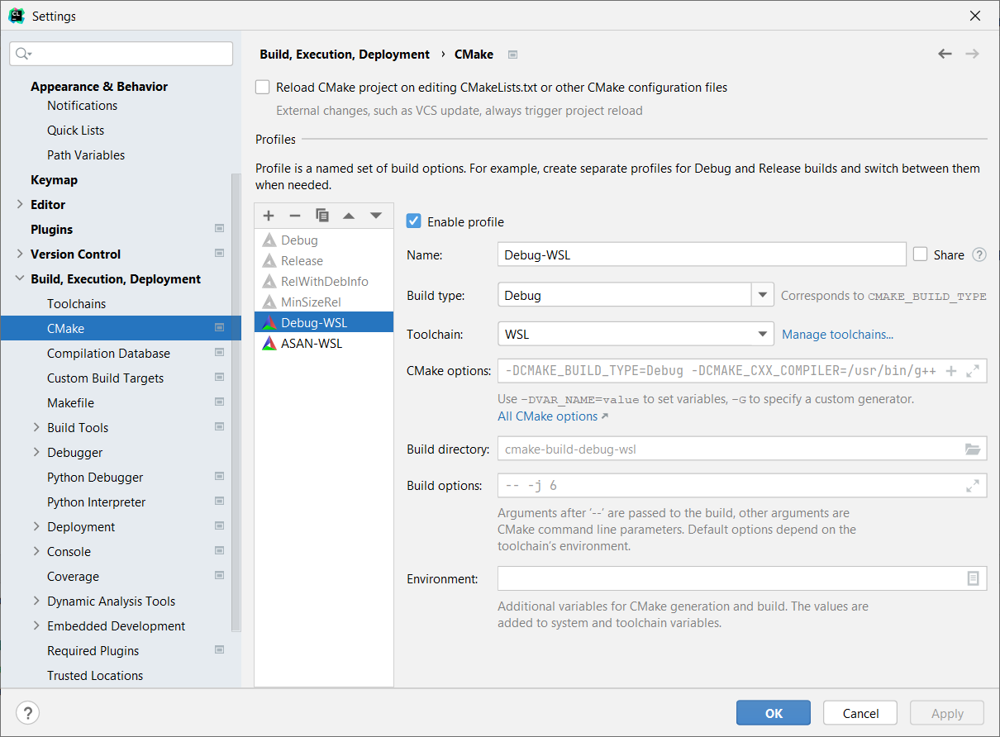
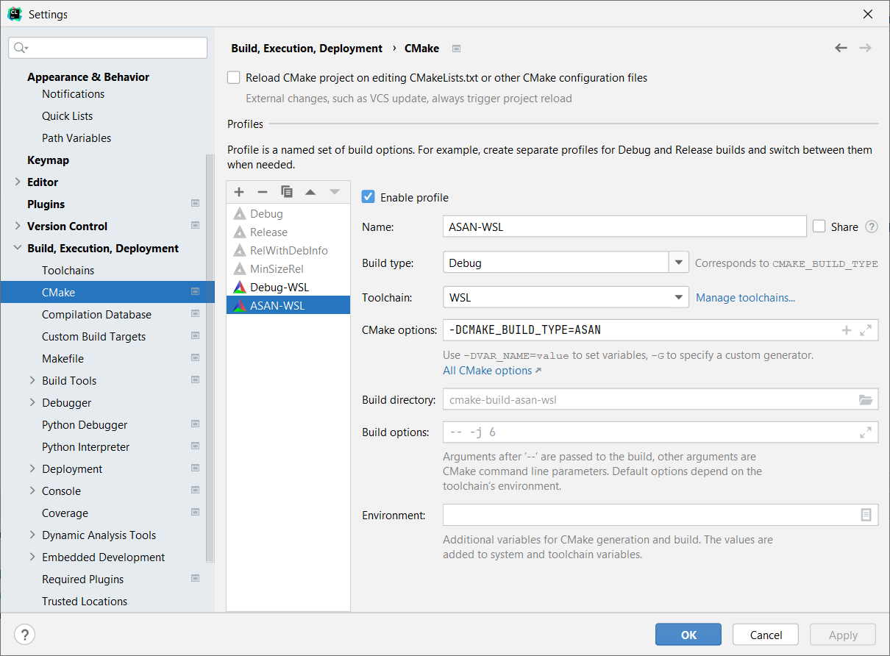
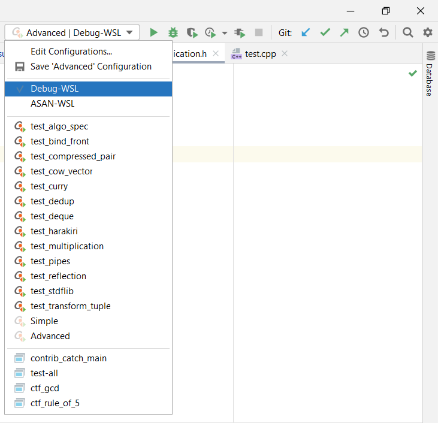

# Настройка окружения на Windows

Здесь описано, как настроить окружение на Windows с использованием WSL (Windows Subsystem from Linux) и IDE CLion.

1. Установите WSL2 [по инструкции](https://docs.microsoft.com/ru-ru/windows/wsl/install-win10#manual-installation-steps). Дистрибутив лучше взять Ubuntu 20.04.
2. Запустите WSL2 и установите в ней необходимые инструменты (компилятор, отладчик, CMake):

```
sudo apt update
sudo apt install -y g++-10 gdb cmake
sudo ln -s /usr/bin/g++-10 /usr/bin/g++
```

После убедитесь, что все установилось как надо: `cmake --version` должен выдавать версию не ниже 3.13, `g++ --version`--- не ниже 10.3.

3. Откройте Windows Powershell. Перейдите с помощью `cd` в каталог, в котором будет храниться репозиторий курса, можно использовать домашний: `cd ~`.

4. В PowerShell (то есть находясь в Windows) проделайте действия из разделов "Регистрация в системе" и "Подготовка локального репозитория" основной инструкции. Команду `ssh-keygen` стоит запускать без параметров и на все вопросы нажимать Enter.

**Важно!** Не нужно клонировать репозиторий внутри WSL. Она будет использоваться исключительно CLion-ом для сборки и запуска в Linux-окружении. Вам напрямую работать с WSL после шага 2 не нужно.

Если PowerShell пишет, что не найден `git`, то установите его [по инструкции](https://github.com/git-guides/install-git#install-git-on-windows).

5. Установите свежий (версия не ниже 2021.2) CLion [с официального сайта](https://www.jetbrains.com/clion/).

6. Настройте в CLion WSL-toolchain по [инструкции](https://www.jetbrains.com/help/clion/how-to-use-wsl-development-environment-in-product.html#wsl-general).

7. Настройте два CMake-профиля для вашего нового toolchain. Для этого зайдите в Preferences -> Build, Execution, Deployment -> CMake, создайте два новых профиля:

   -  Name: `Debug-WSL`, toolchain: `WSL`, build type: `Debug`, остальное по умолчанию
   -  Name: `ASAN-WSL`, toolchain: `WSL`, build type: `Debug`, CMake options: `-DCMAKE_BUILD_TYPE=ASAN`, остальное по умолчанию

Должно получиться так:






8. Сохраните ваши настройки, перезагрузите CLion и откройте в нем каталог с репозиторием. Проверьте, что профили из прошлого пункта появились в окне выбора целей:



9. Окружение настроено, можно переходить к пункту "Сдача первой задачи" основной инструкции. Сдавать задачи нужно из PowerShell, обновлять репозиторий тоже.

**Важно!** В случае проблем при submit проверьте, что `python3` есть в системе и добавлен в PATH.
